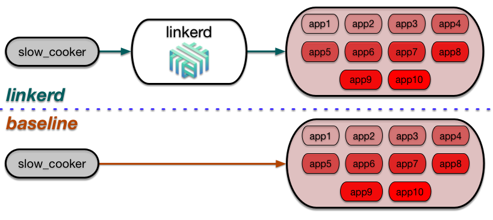

# Go faster by adding more steps (on Kubernetes)

This directory contains a Kubernetes config that runs a demo that you can use to
test linkerd's performance. The results of the demo are discussed in much more
detail in Buoyant's blog post,
[Making Things Faster by Adding More Steps](https://blog.buoyant.io/2017/01/31/making-things-faster-by-adding-more-steps/).

## Deploy

The [`add-steps.yml`](add-steps.yml) file that's included in this directory is
configured to run the demo. Deploy it to Kubernetes with:

```bash
curl https://raw.githubusercontent.com/linkerd/linkerd-examples/master/add-steps/k8s/add-steps.yml | kubectl apply -f -
```

## View The Demo

Once up and running, open a port to the demo with:

```bash
kubectl -n add-steps port-forward $(kubectl -n add-steps get po --selector=app=grafana -o jsonpath='{.items[*].metadata.name}') 3000:3000
```

Then browse to http://localhost:3000 to view the demo. It will take about a
minute to begin reporting data:


## Demo Details

Here's an overview of the demo you just deployed:



* **2 slow_cookers**: Traffic is generated using [slow\_cooker](
https://github.com/BuoyantIO/slow_cooker). The slow\_cookers are configured to
send 500 requests per second to both the linkerd cluster and the baseline
cluster.

* **linkerd**: linkerd is configured via a `linkerd.yml` config file, defined as
a `ConfigMap` in [`add-steps.yml`](add-steps.yml). This specifies a router
running on port 4140, configured to route traffic to a backend app cluster, via
Kubernetes service discovery.

* **2 backend clusters**: Each cluster runs 10 instances of the go web server
that's defined in [`server.go`](../server.go). One cluster is fronted by
linkerd, another baseline cluster simply uses a Kubernetes `Service` object.
Instance response times vary between 0 and 2 seconds. The slowest instances also
simulate a decrease in success rate.

* **prometheus**: linkerd, slow\_cooker, and the backend instances expose
metrics data in a format that can be read by
[Prometheus](https://prometheus.io/). Prometheus metrics collection is
configured via a `prometheus.yml` config file, defined as a `ConfigMap` in
[`add-steps.yml`](add-steps.yml). This file instructs Prometheus to scrape
metrics from all processes every 5 seconds.

* **grafana**: Collected metrics are displayed on a dashboard using [Grafana](
http://grafana.org/). The grafana container is preconfigured to display
dashboard comparing linkerd and the baseline cluster, defined via a
`making-things-faster-by-adding-more-steps.json` dashboard file, as a
`ConfigMap` in [`add-steps.yml`](add-steps.yml).

## Dashboards

### Prometheus

To view the Prometheus dashboard for raw metrics from all processes:

```bash
kubectl -n add-steps port-forward $(kubectl --namespace=add-steps get po --selector=app=prometheus -o jsonpath='{.items[*].metadata.name}') 9090:9090
```

Then browse to http://localhost:9090 to view Prometheus.

### Linkerd admin

To view the Linkerd admin dashboard:

```bash
kubectl -n add-steps port-forward $(kubectl --namespace=add-steps get po --selector=app=l5d -o jsonpath='{.items[*].metadata.name}') 9990:9990
```

Then browse to http://localhost:9990 to view the Linkerd Admin Dashboard.

## Troubleshooting

If you have any issues getting the demo up and running, pop into [linkerd's
Slack]( https://slack.linkerd.io) and we'll help you get it sorted out.

Thanks! 👋

## Build

If you make changes to [`server.go`](../server.go):

```bash
docker build ../ -t buoyantio/add-steps-app:v1
docker push buoyantio/add-steps-app:v1
```
