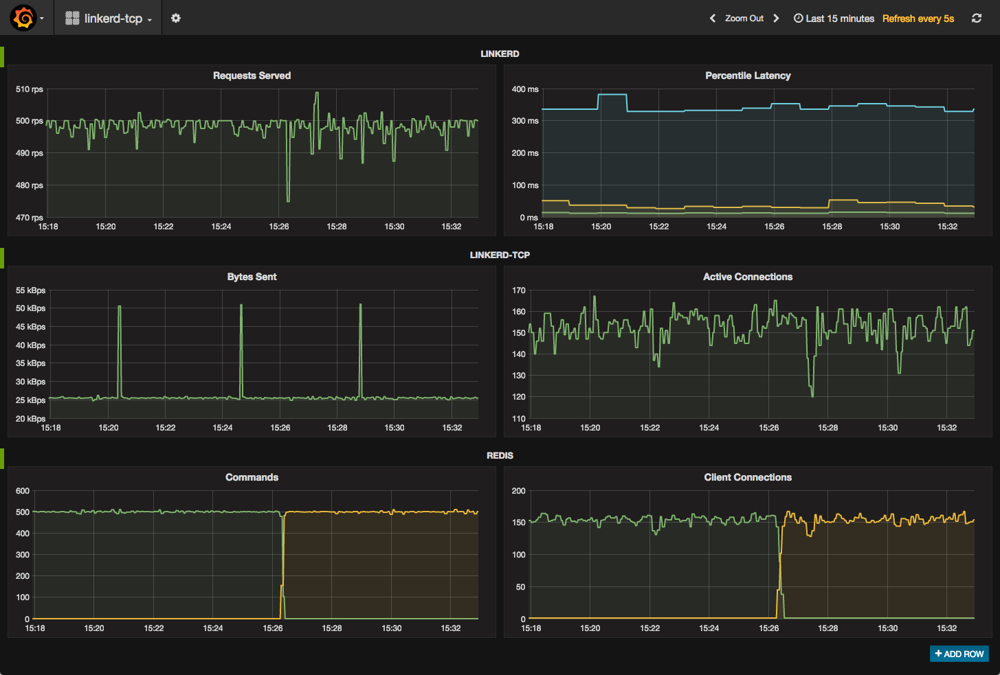

# linkerd-tcp

This directory contains a docker-compose environment that runs a demo that you
can use to try out [linkerd-tcp](https://github.com/linkerd/linkerd-tcp).

## Startup

The [`docker-compose.yml`](docker-compose.yml) file that's included in this
directory is configured to run the demo. Start everything with:

```bash
$ docker-compose build && docker-compose up -d
```

That command will start [linkerd-viz](https://github.com/linkerd/linkerd-viz)
on port 3000 on your Docker host, which you can use to view the demo in action.
Set the `DOCKER_IP` environment variable to your Docker IP (e.g.
`DOCKER_IP=localhost` for Docker For Mac, or `DOCKER_IP=$(docker-machine ip)`
for Docker Toolkit), and then open the dashboard with:

```bash
$ open http://$DOCKER_IP:3000 # on OS X
```

It will look like this:



The docker environment is also running all of the following containers:

* **namerd**: namerd is configured via the provided [`namerd.yml`](namerd.yml)
file, which defines a `default` namespace that can be used to route traffic
using the `io.l5d.fs` namer in conjunction with the files in the [`disco`](
disco/) directory.

* **linkerd**: linkerd is configured via the provided [`linkerd.yml`](
linkerd.yml), which specifies 1 HTTP router running on port 4140, routing HTTP
traffic via namerd.

* **linkerd-tcp**: linkerd-tcp is configured via the provided
[`linkerd-tcp.yml`](linkerd-tcp.yml), which specifies 1 TCP proxy running on
port 7474, routing redis traffic via namerd.

* **redis**: Two [redis](https://redis.io/) clusters are configured to run on
ports 6379 and 6380. The `default` namerd namespace is setup to send all redis
traffic to the first redis cluster, but that routing decision can be changed by
modifying namerd's dtab.

* **web service**: The web service is composed of 10 instances of the HTTP web
service defined in [`web.go`](web.go). The web service responds to HTTP requests
with the string "hello", caches its responses in redis. If the response is found
in cache, it returns immediately. On cache miss, it sleeps for 300 milliseconds
before returning.

* **slow_cooker**: Traffic to linkerd is generated using [slow\_cooker](
https://github.com/BuoyantIO/slow_cooker). slow\_cooker is configured to send
500 requests per second to the linkerd HTTP router, which load balances the
requests over all 10 instances of the web service.

* **linkerd-viz**: linkerd, linkerd-tcp, and redis expose metrics data in a
format that can be read by [Prometheus](https://prometheus.io/). Those metrics
are collected by the linkerd-viz container and displayed on dashboards using
[Grafana](https://grafana.com/). The linkerd-viz UI is running on port 3000.

## Traffic shifting

Once the demo is up and running, you can shift traffic between the two redis
clusters by updating the default routing rules that are stored in namerd. To do
this, use the [namerctl](https://github.com/linkerd/namerctl) command line
utility. Install it with:

```bash
$ go get -u github.com/linkerd/namerctl
```

namerctl uses namerd's HTTP API, which is running on port 4180 on your Docker
host. Set the `DOCKER_IP` environment variable as described above, and then
configure namerctl to talk to namerd by setting the `NAMERCTL_BASE_URL`
environment variable:

```bash
$ export NAMERCTL_BASE_URL=http://$DOCKER_IP:4180
```

Fetch namerd's current routing configuration:

```bash
$ namerctl dtab get default
# version AAAAAAAAAAE=
/cluster    => /#/io.l5d.fs ;
/svc        => /cluster ;
/svc/redis  => /cluster/redis1 ;
```

You can see that the final dtab entry is routing all redis traffic to the first
redis cluster. Use namerctl to route all traffic to the second cluster:

```bash
$ namerctl dtab get default | sed 's/redis1/redis2/' > default.dtab
$ namerctl dtab update default default.dtab
Updated default
```

The linkerd-viz dashboard will show traffic switching from redis1 to redis2.

### Namerctl without a Go environment

Alternatively, if you do not have a working Go environment, you can run namerctl
from a Docker container.

```bash
export NAMERCTL_BASE_URL=http://$DOCKER_IP:4180

# get dtab
docker run -e NAMERCTL_BASE_URL=$NAMERCTL_BASE_URL linkerd/namerctl:0.8.6 dtab get default

# edit dtab
docker run -e NAMERCTL_BASE_URL=$NAMERCTL_BASE_URL linkerd/namerctl:0.8.6 dtab get default | sed 's/redis1/redis2/' > default.dtab

# update dtab
docker run -e NAMERCTL_BASE_URL=$NAMERCTL_BASE_URL -v `pwd`:/dtab linkerd/namerctl:0.8.6 dtab update default /dtab/default.dtab
```

## Troubleshooting

If you have any issues getting the demo up and running, pop into [linkerd's
Slack]( https://slack.linkerd.io) and we'll help you get it sorted out.

Thanks! 👋
